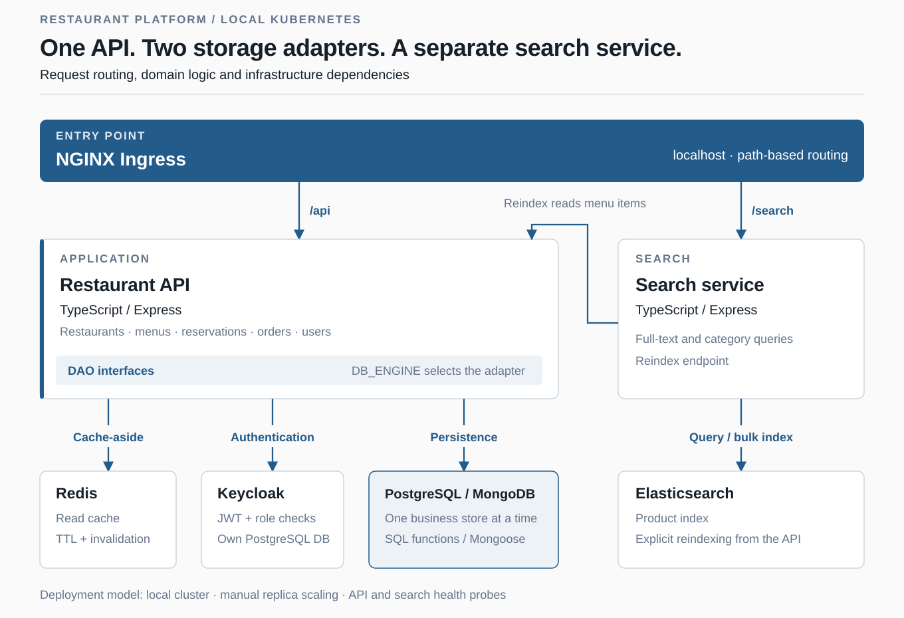

# Restaurant Platform

A two-service backend for restaurant menus, reservations and orders. The API selects PostgreSQL or MongoDB through a shared data-access layer; Redis handles read caching, and a separate service provides Elasticsearch search.

Academic team project for Database Systems 2 at Tecnológico de Costa Rica, 2026. The deployment scripts target a local Docker Desktop Kubernetes cluster.

[Español](README.es.md) · [Analytics extension](https://github.com/joshuacorraless/OLAP-Restaurantes-e2) · [CI runs](https://github.com/joshuacorraless/Restaurantes-e2/actions/workflows/ci.yml)

## Architecture



The business database is selected with `DB_ENGINE`; the application does not write to both engines at once. In Kubernetes, MongoDB uses a sharded replica-set topology. Keycloak has its own PostgreSQL store regardless of the business database.

## Team and contributions

Built by **Joshua Corrales Retana** and **Felipe Lepiz Retana**.

- Joshua's contributions include the [database selection and DAO layer](https://github.com/joshuacorraless/Restaurantes-e2/commit/39731caf75a13e136844563c1da48f76be0a09ef), [Redis caching](https://github.com/joshuacorraless/Restaurantes-e2/commit/6d567265cd58160a1a803cd7e9fcdfa0e17a12f6) and [Kubernetes manifests](https://github.com/joshuacorraless/Restaurantes-e2/commit/438ffece6fb7ae719c9ccee449c9cef7517f5969).
- Felipe's contributions include the [search service](https://github.com/joshuacorraless/Restaurantes-e2/commit/1a160e3bd830bebaf6619768462a4e000a3abb32) and [tests and CI integration](https://github.com/joshuacorraless/Restaurantes-e2/commit/a9731ba0ceb5886c49627bff1a4d0e1ee6cde9dc).

These links identify selected contributions, not an exhaustive division of the team's work.

## Start with the tests

From a clone of the repository, with Node.js 20 and npm:

```bash
npm ci --prefix apps/api
npm run test:coverage --prefix apps/api
npm ci --prefix apps/search
npm run test:coverage --prefix apps/search
```

Both services use TypeScript, Express, Jest and Supertest. Unit and HTTP-level tests mock external dependencies, including databases, Redis, Keycloak and Elasticsearch; they do not require the running cluster. Both Jest configurations enforce a **90% minimum line-coverage threshold**.

Coverage reports are generated locally under each service's `coverage/` directory. CI runs the tests on pull requests; a separate workflow builds and publishes Docker images on pushes to `main`. See the [workflow definitions](.github/workflows/).

## Run the local stack

Use PowerShell, Docker Desktop with Kubernetes enabled, `kubectl`, and an installed NGINX Ingress Controller.

The deployment currently requires local files that are not committed: API and Keycloak secrets, a Keycloak realm import, and a PostgreSQL secret when that engine is selected. The public tree does not include the example manifests referenced by the older deployment guide. Prepare these files before running the script; this prerequisite also applies to the analytics extension.

Once the local configuration is ready, run **one** of:

```powershell
.\infra\k8s\deploy.ps1 -DbEngine postgres
# Or: .\infra\k8s\deploy.ps1 -DbEngine mongo
```

The [deployment guide](Guia%20para%20correr%20proyecto%20y%20verificar%20funcionalidad.md) covers the runtime sequence. The [Kubernetes reference](infra/k8s/README.md) explains the manifests and engine selection; [Keycloak setup](docs/KEYCLOAK-SETUP.md) covers the realm and clients.

The optional [seed generator](database/seeds/README.md) requires a Gemini API key and a running cluster. Set `DB_ENGINE` to the same engine used for deployment before generating data. After creating menu items, rebuild the search index:

```powershell
curl.exe -X POST http://localhost/search/reindex
curl.exe http://localhost/api/restaurants
curl.exe "http://localhost/search/products?q=casado"
```

For Swagger, forward the API service in a separate terminal and open `http://localhost:3000/api-docs`:

```powershell
kubectl port-forward -n proyecto01-restaurante svc/api-service 3000:80
```

API and search deployments can be scaled manually with `kubectl scale`. The repository includes a [balance-check procedure](docs/adr/ADR-009-validacion-balanceo-carga.md); it does not provide measured throughput or latency improvements.

## Scope and reference

This is a local academic system, not a maintained public deployment. Search reindexing is explicit; the transactional project does not continuously synchronize Elasticsearch. Docker publishing is separate from Kubernetes deployment.

- [API source and OpenAPI contract](apps/api/src/)
- [Search source](apps/search/src/)
- [SQL schema and functions](database/)
- [Architecture decisions](docs/adr/README.md)
- [Spanish endpoint catalogue and project reference](README.es.md)
- [OLAP extension: Hive, Spark, Airflow, Superset and Neo4j](https://github.com/joshuacorraless/OLAP-Restaurantes-e2)

